# The elevators

Ascension Tower's lifts connect the three sectors. From the project brief: *"A glass elevator connects the levels and acts as a playable transition rather than a loading screen."*

| Lift | Between | Status |
| --- | --- | --- |
| Calibration Lift | Level 1 → Level 2 | Done - part of the Causeway (`src/levels/causeway/`), see [`level-transition.md`](./level-transition.md) |
| Calibration Lift (shared) | end of Level 2, end of Level 3's corridor | Done - `src/levels/common/calibration-lift.js` (from the Level 3 work). At the end of Level 2 you board it; it hands over to the Gravity Fault |
| **Gravity Fault** | Level 2 → Level 3 | **Built** (this document): the tower collapsing around the lift, a cable snap and free fall, the launcher, and the three brake clamps to shoot |
| **Elevator interior** | every enclosed ride | **Built** (section 4): one reusable cabin - doors, button panel, floor display, ceiling light, speaker, security camera, the subjects' scratched messages |
| **Quiet ride** (cutscene 7) | Labs → Skyline | **Built** (section 5): alone for the first time after the scientist's sacrifice, the pilot on the radio. Demo key `6` |
| Level 3 arrival and roof lifts | Level 3 start, roof | Placeholders in `src/levels/meltdown/elevator.js` |

---

## 1. The Gravity Fault (Level 2 → Level 3)

### What the player sees

The Foundry's extraction valve breaks and Subject 07 runs on across a landing into the Calibration Lift (the shared glass lift). Its doors close and it starts to climb; 2.2 s in, the screen fades and the Gravity Fault takes over, already climbing the outside of the tower. Then the tower starts coming down around it.

The ride is a sequence of **phases** (`PHASES` in `gravity-fault.js`); each has its own camera shots, lights, physics and beats. Times are for the full ride as demo key `5` plays it (from the Calibration Lift it starts at *climb*).

| Phase | Length | What happens | Camera |
| --- | --- | --- | --- |
| **board** | 1.8 s | Doors close on the Foundry's orange glow | Front corner, looking back at the doors |
| **climb** | 2.8 s | Launch (a jolt); up the outside of Ascension Tower at 13 m/s | Outside, over the drop |
| **tremor** | 3.6 s | The building shakes. The left pane **cracks** - you watch the fractures spread - then **blows out**, shards tumbling down the shaft. The lights flicker, one strip dies, the lift judders to a stall. Subject 07 flinches, turns to the glass, stumbles, grabs for balance and braces | First person, then on Subject 07 |
| **freefall** | 2.0 s | **The cable snaps.** Blackout, red emergency beacon, the energy conduits stutter red. Two seconds of real free fall (~20 m): the floor counter runs *backwards*, and inside the cabin everything is **weightless** - Subject 07, the toolbox, the extinguisher, the spent spheres and the fallen shards drift up off the floor. The front pane cracks. The rails start to scream | First person, then outside below it as it falls past, then inside among the floating debris |
| **brake** | 1.6 s | **The emergency brakes bite**: a shower of sparks from the brake shoes and a ~7 g stop. Everything slams down, the right pane blows out, Subject 07 is thrown into a crouch. The lights stutter back, dimmer | First person, then on Subject 07 |
| **launcher** | 3.9 s | A thud on the roof. **Level 3's launcher** - the failed experiment, falling from the lab above - crashes through the glass ceiling and clatters onto the floor. Subject 07 looks at it, walks over, crouches, picks it up and swings it to the shoulder | On Subject 07, low looking up at the roof caving in, then low and close for the pickup |
| **clamps** | up to 11 s | **Playable.** The brakes are slipping - the cabin sinks in jerks. Three **brake clamps** (the brief's stabilisers) glow red and spark: two on the front rails, one on the cable governor on the roof. Click to fire the launcher at them. Each lock changes the camera, and a **diagnostic monitor** (picture-in-picture) shows the top-down view until it becomes the main view. All three: `+bonus`. Out of time: the clamps force-lock with a jolt, no bonus - **the ride never fails** | 1st clamp: first person · 2nd: outside, in front · 3rd: **top-down orthographic diagnostic view** (hologram) |
| **resume** | 3.2 s | Brakes released; the lift climbs on, fade out. Level 3 opens with its own arrival lift | Outside, the cabin rising out of frame |

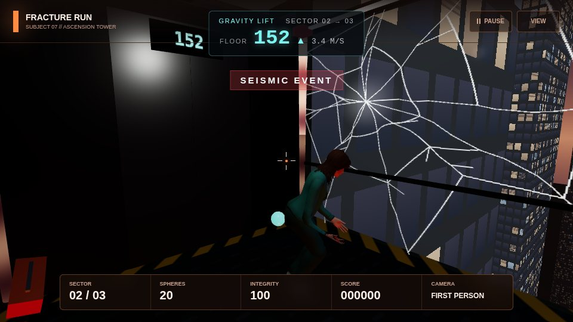
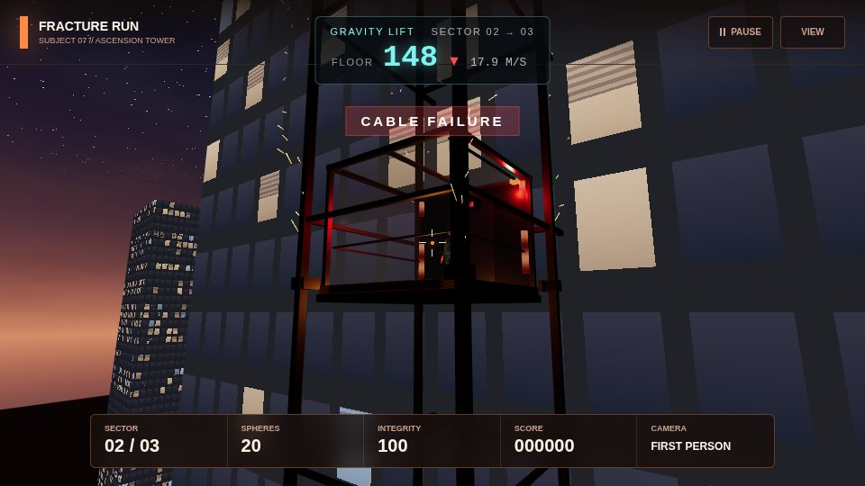
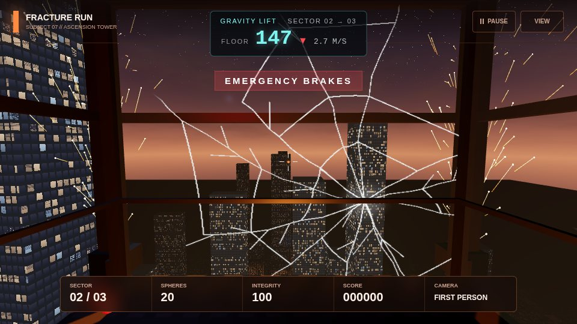
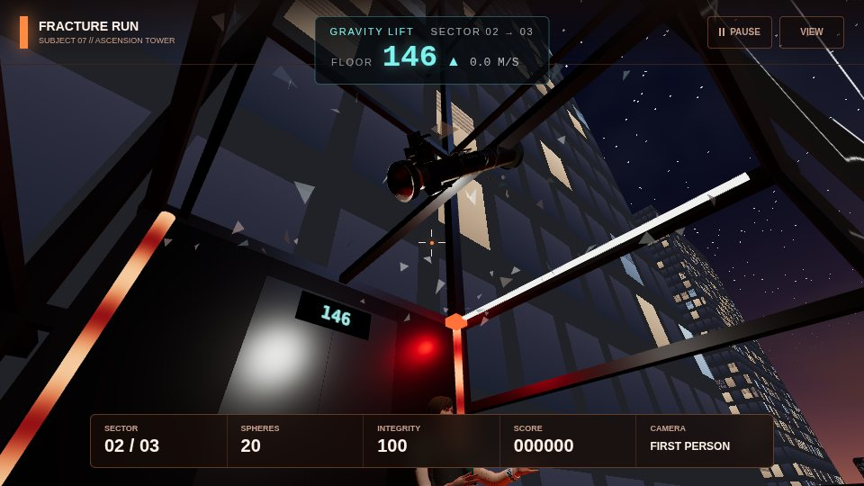
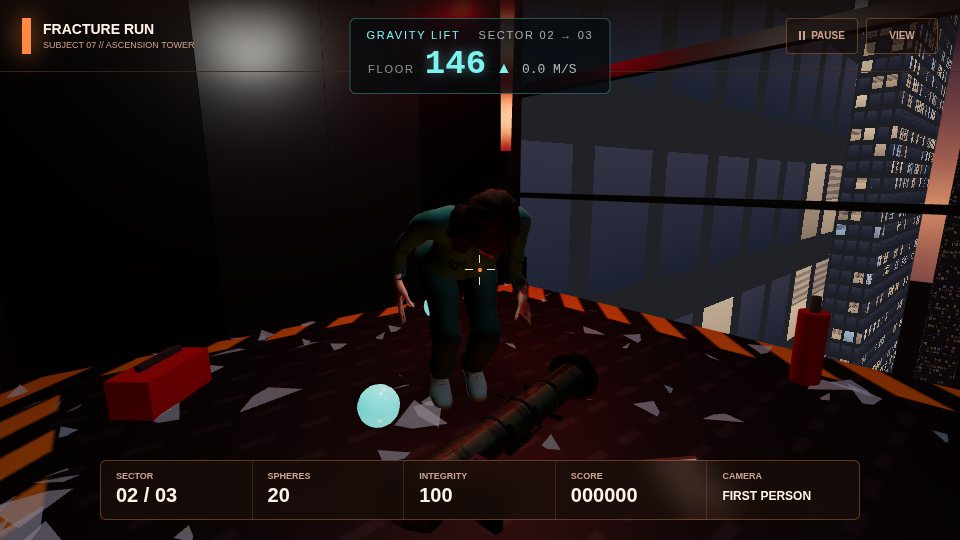
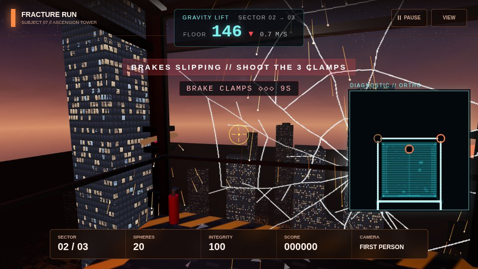
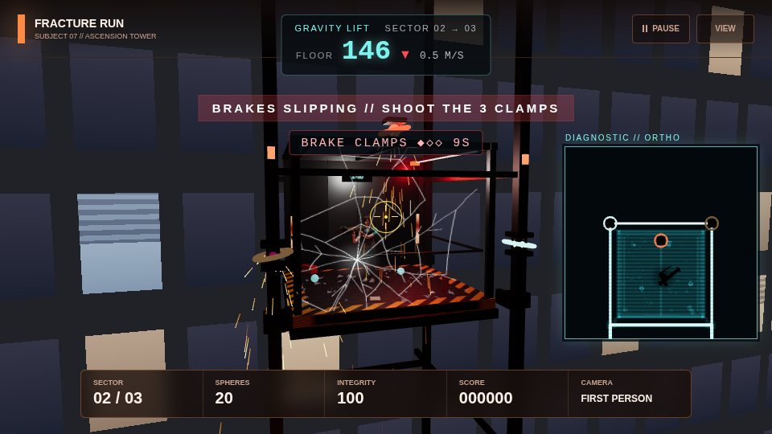
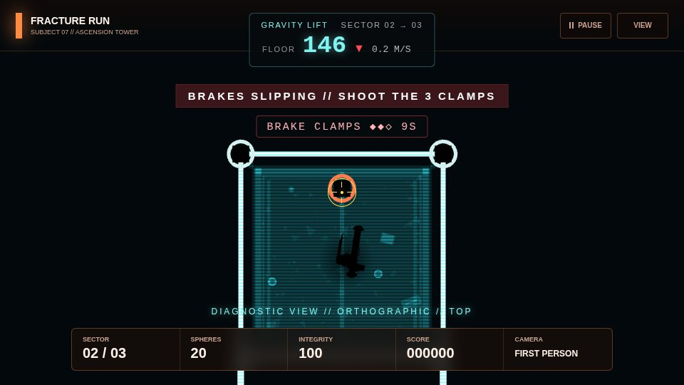

### One rule for everything loose: felt gravity

Everything loose inside the cabin - the character, the debris, the shards that fall in, the launcher - is simulated in the **cabin's own frame** under the gravity felt there:

```text
gEff = 9.8 + (the cabin's vertical acceleration)
```

Climbing steadily: 9.8. Free fall: the cabin accelerates down at 9.8, so `gEff` = 0 and things float. The brakes stopping a 19.6 m/s fall in 0.35 s: `gEff` ≈ 66, about 7 g, so everything slams down. No special cases - the float and the slam both fall out of the same physics, and the brief's "gravity weakens" is literally what happens in a falling lift.

### The character acts

`acting.js` drives Level 3's player body (`PlayerAvatar`, the character picked on the start screen) directly through its rig controls - crouch, knee tuck, torso lean, arms raised, arm swing, steps, the launcher hold - plus the body's own position and turn. Behaviours layer and blend:

- **idle** - breathing, weight shifts, looking around (out at the city, down, back)
- **fear** - builds with every scare and fades slowly: faster, heavier breathing, jumpier glances, arms held up in front, a lower stance
- **react / stumble / brace** - flinching toward a crack, staggered steps with arms out, knees bent holding on
- **gravity** - the body floats in free fall (knees tucked, arms reaching and paddling, a slow tumble) and a hard landing or the brakes' g-force drops it into a deep crouch
- **walk, look up, pick up, hold, aim** - for the launcher and the clamps (turns to face whichever clamp you are aiming at)

### How it is built

The ride is a self-contained module, like Level 3: its own scene, cameras and HUD, drawn with the game's renderer. It does not change any level's code.

```text
src/elevators/
  gravity-fault.js   GravityFaultRide - the phases, cabin motion, beats, cameras, rendering
  kit.js             the world (sky, city, skyline, tower), the shaft, the cabin (lights,
                     named panes, brake shoes), the stand-in figure
  shaders.js         GLSL: facade windows and fire, sky, city lights, energy conduits
  shake.js           trauma-based camera shake (moves and rotates) and jolts
  sparks.js          pooled spark particles: streaks and glowing heads
  glass.js           panes cracking (procedural crack texture + reveal shader) and
                     shattering into instanced shards (outside: world; inside: felt gravity)
  debris.js          loose objects in the cabin
  acting.js          the character's performance
  launcher.js        the launcher prop: falling in, landing, the pickup to the hands
  clamps.js          the brake clamps, launcher balls, aim assist
  diagnostic.js      the orthographic top-down view: hologram pass + marked objects,
                     full screen or picture-in-picture
src/ui/
  elevator-hud.js    floor counter, alerts, clamp counter, the monitor's frame
  elevator-hud.css
tests/elevators/
  run.js             check harness (--shots / --shots-only for the images above)
  checks/gravity-lift.js
```

**Scene hierarchy**

```text
RideScene
|-- RideWorld          sky sphere, city plane, instanced skyline, Ascension Tower
|-- LiftShaft          four rails, instanced ring beams and marker lamps
|-- GravityLiftCabin   moves up (and down) the shaft
|   |-- frame, panes (+ crack overlays), doors, floor display, conduits, brake shoes
|   |-- cabin light, emergency beacon, spark glow
|   |-- shards that fell in, loose debris
|   |-- BrakeClamp0-2
|   `-- PlayerRoot     the character (Level 3's PlayerAvatar)
|       `-- LauncherMount
|           `-- Launcher   (once picked up; before that, a child of the cabin)
|-- Sparks             streaks + heads
|-- shards             blown out, falling down the shaft
|-- launcher balls
`-- moon, fire uplight from below, hemisphere
```

**Cameras**: one perspective camera placed per shot (doors, exterior, interior, close, falling, roof, pickup, front, rising), and one **orthographic** camera for the diagnostic view. The diagnostic view renders twice - everything on its scan layer with a hologram override material, then the clamps, the character and the launcher on its mark layer in their own colours - either full screen or into a corner with a viewport and scissor (picture-in-picture).

**Shaders** (`shaders.js`, plus the crack shader in `glass.js`, the spark shader in `sparks.js` and the hologram in `diagnostic.js`):

| Shader | Technique |
| --- | --- |
| Facade | Windows are a grid in *world space*, so any box - the tower or an instanced skyline building - gets them for free. Per-window hash decides lit/unlit, warm/cool, blinds; floors below a *fire line* burn and flicker, with soot fading up the wall |
| Sky | Gradient, fire glow on the horizon, fbm storm clouds lit from below, stars, and a `uFlash` lightning uniform |
| City | Street grid, scattered lit windows and flickering fires on a plane far below |
| Energy | The brief's energy material: bands flowing up the conduits, edge glow, and `uFault` for the red stutter |
| Cracks | A crack pattern drawn once per pane on a canvas; the shader reveals it outward from the impact point (`uReveal`) and frosts the glass around it |
| Sparks | Point sprites with a hot core cooling from white to orange (the streaks are line segments along each spark's velocity) |
| Hologram | Brightness from how side-on a surface is to the camera, travelling height bands, screen-space scanlines; additive |

### How it plugs into `main.js`

The `GRAVITY LIFT` block in `main.js`:

```text
Foundry "complete" ─► the player runs on, into the Calibration Lift   (existing)
      │  startFoundryLift(): doors close, it climbs
      │  2.2 s in (FOUNDRY_LIFT_HANDOFF): 0.5 s fade to black
      ▼
startGravityLift({ boarded: true })
   · Level 2 and its Calibration Lift hidden and disposed
   · Level 3's models start streaming (preloadMeltdown)
   · Level 3 is BUILT now, behind the black (prepareMeltdown): its models
     attach and its shaders compile in the background while the ride plays
     (MeltdownLevel.prewarmAsync), so it is ready when the ride ends
   · new GravityFaultRide({ renderer, spheres: ammo, reducedMotion, boarded,
                              character: the chosen model, assetBase: Level 3's assets })
      │  every frame: updateGravityLiftFrame() → ride.update(), ride.render()
      │  the fade overlay follows ride.fade
      ▼
finishGravityLift()          when ride.result.done
   · score += result.bonus, ammo = result.spheres
   · ride disposed
   · enterMeltdown()          (existing - Level 3 opens in its arrival lift;
                                it only has to show the Level 3 built above)
```

Before this, Level 3 was built after the ride, behind a black screen - 15-20 s on the lab machines. Now the build (the one part that has to block, about half of the work) happens while the screen is already black from boarding, and the rest overlaps the ride. The *ride to Level 3* check fails if more than 1.5 s of black follows the ride.

- The pointer is forwarded with `ride.onPointerMove(x, y)` (the game's normalised pointer, so the sensitivity setting applies), and a left click calls `ride.fire()`. While `ride.wantsAim` the game's crosshair shows, and goes "hot" over a clamp (`ride.aimTarget`).
- Restart, quit and every demo jump call `leaveGravityLift()`, so a ride never outlives the run.
- **Demo key `5`** jumps straight into the ride from anywhere in a run. `__dbg.gravityLift` and `__dbg.demoGravityLift()` are there for the checks and the console.
- **Reduced motion** (Settings) calms the shake and the exterior camera's swing.

**Events** (`ride.events.on(name, fn)`) for the audio workstream: `shot` (`{ shot }`), `depart`, `tremor`, `flicker`, `glass-crack`, `glass-break`, `cable-snap`, `brake`, `brake-slam`, `launcher-thud`, `launcher-land`, `pickup`, `clamps`, `clamp-shot`, `clamp-lock`, `clamps-locked`, `clamps-forced`, `resume`, `arrive`.

### What carries over

| State | Carries? |
| --- | --- |
| Score | Yes, plus the ride's bonus: 400 per clamp you lock, and if you lock all three, 800 + 50 per second left |
| Spheres | Yes - they become extra balls in Level 3, as before |
| Integrity | Level 3 resets it, as before |
| The launcher | Yes, in story terms: Subject 07 picks it up in the lift and opens Level 3 holding it |

---

## 2. Level 3's lifts (next)

The Level 3 corridor's exit lift is now the shared Calibration Lift (from the Level 3 work). Still placeholders: the arrival lift at the start of Level 3 and the roof's lift housing (`src/levels/meltdown/elevator.js`, API `setDoors`, `setLight`, `setIndicator`, `dispose`). Plan, to be agreed with the Level 3 owner:

- A proper freight lift model for the arrival lift, matching the Gravity Fault's jolt as it arrives.
- **Level 3 → roof:** the Calibration Lift ride continuing up the outside of the burning building - fire and smoke below, the floor counter racing, the helicopter's searchlight sweeping past - before the doors open on the roof.

---

## 4. The elevator interior (reusable)

[`src/elevators/interior.js`](../src/elevators/interior.js) - `buildInterior(owned)` returns one enclosed freight lift, 2.4 × 2.2 × 2.6 m, for any ride that stays inside the cabin (the task sheet's "one reusable scene for every transition and for the unlimited mode"). Every surface is a canvas texture drawn in code, so nothing has to load.

| Part | What it is |
| --- | --- |
| Walls | Brushed steel: fine streaks, panel seams, rivets, grime at the bottom; handrails on three sides |
| Doors | Two sliding leaves (`setDoors(0..1)`, eased). Light from the floors passing leaks through the seam while it moves; daylight behind them when they open |
| Floor display | Over the doors: orange LED floor number and an arrow (`setFloor("12", "up")`) |
| Button panel | Right of the doors: R, SB (skybridge), 40 … 10, L, B1; `press("SB")` lights one |
| Ceiling light | A panel and a point light; `setLight(0..1)` dims or flickers it |
| Speaker grille | Top left of the front wall - where the pilot's voice would come from |
| Security camera | Dome in the back corner of the ceiling, its red recording light blinking - the lab is still watching |
| **Environmental storytelling** | The left wall: tally marks in fives, and messages scratched by earlier subjects - *S-04 WAS HERE*, *THEY LIE ABOUT THE ROOF*, *DONT LET THEM PUT YOU UNDER*, *S-09*. On the floor: a torn Halcyon Labs badge, *ACCESS: B2* |

Local frame: floor at y = 0, doors on the -Z wall (the Performer's yaw 0 faces them), `backWall` is where someone stands with their back to the back wall. `update(dt, time, speed)` runs the seam light and the camera's LED.

## 5. The quiet ride - cutscene 7

[`src/elevators/quiet-ride.js`](../src/elevators/quiet-ride.js). From the task sheet: *"The player alone for the first time, holding his equipment, catching their breath. A quiet, powerful beat after cutscene 6."* It is a ride object with the same interface as the Gravity Fault (`update`, `render`, `fade`, `result`, `dispose`, `events`), so `main.js` runs it through the same slot.

| | |
| --- | --- |
| 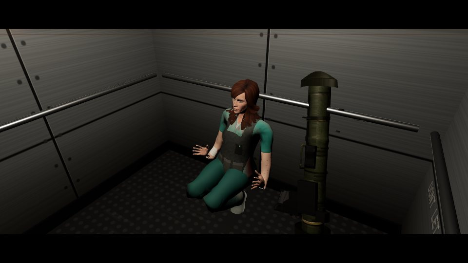 | 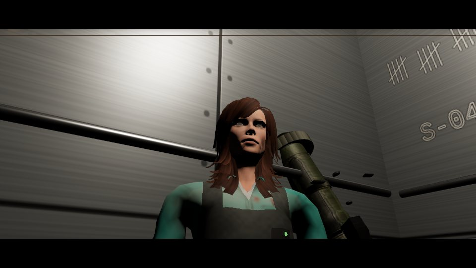 |
| 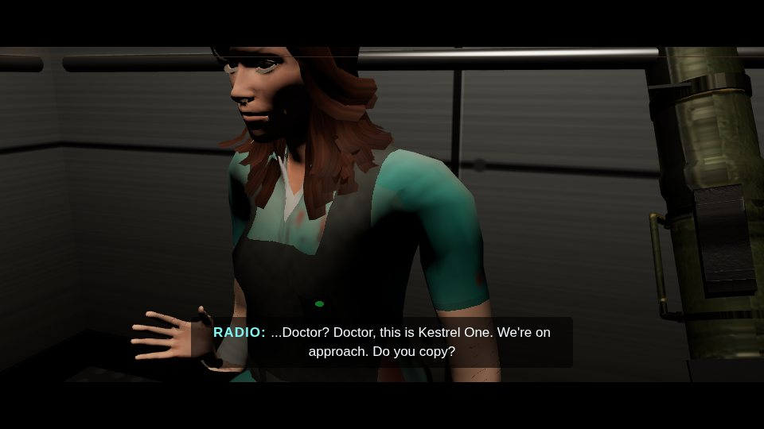 | 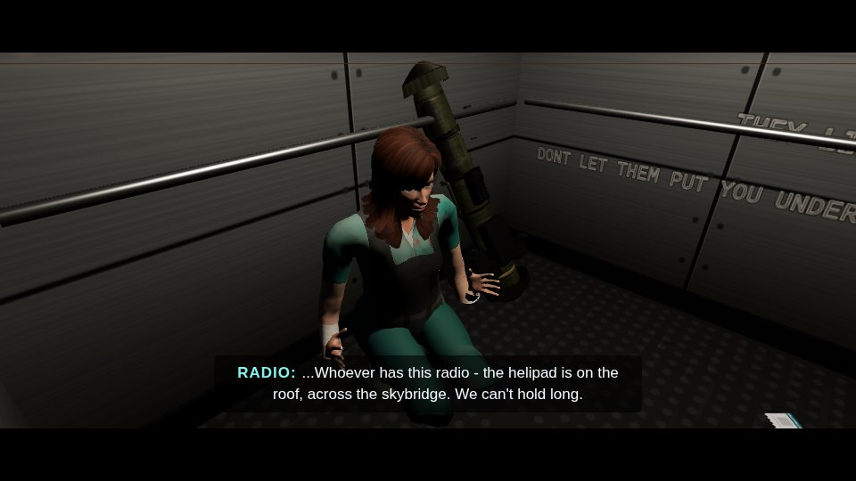 |
| 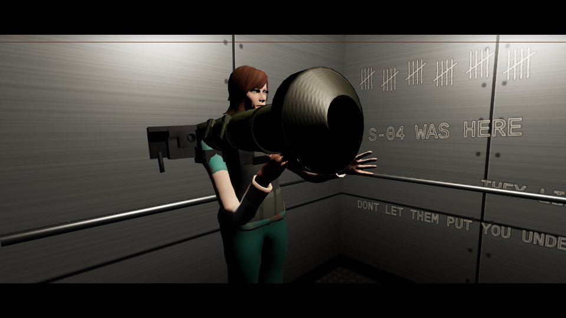 | 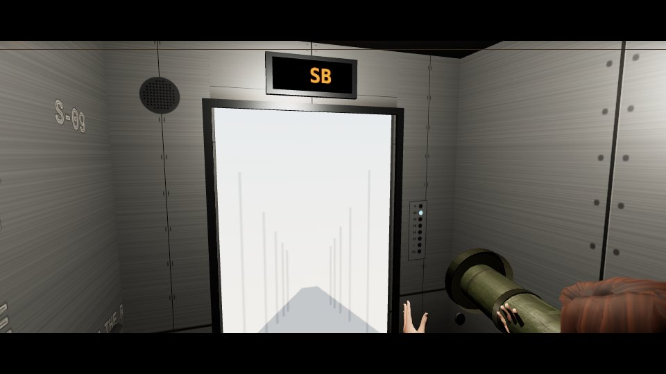 |

| Time | Beat | Shot |
| --- | --- | --- |
| 0.0 | Fade in. The doors have just closed on the scientist. Subject 07 stands against the back wall in his vest, the launcher leaning on the wall beside them, breathing hard | **corner** - from beside the doors |
| 0.3 | The lift lurches and starts to climb; floor light slides past the door seam | |
| 1.2 | They slide down the wall and sit on the floor, knees up | |
| 4.0 | | **low** - close on the face, breathing |
| 5.6 | The radio crackles: *"...Doctor? Doctor, this is Kestrel One. We're on approach. Do you copy?"* They look down at it | **radio** (6.0) - in on the vest and the radio's green light |
| 9.6 | *"...Whoever has this radio - the helipad is on the roof, across the skybridge. We can't hold long."* | |
| 11.2 | | **side** - from the side wall |
| 13.4 | They get up, pick up the launcher and face the doors; the breathing slows | |
| 15.2 | A tremor: the cabin shakes, the light stutters - the building is still coming apart | |
| 16.4 | | **shoulder** - over the shoulder at the doors |
| 17.2 | The lift stops; chime; the display reads **SB** | |
| 17.7 | The doors open on daylight | |
| 20.4 | Fade out, into the Skyline's lift arrival - its doors open on the skybridges | |

The figure is the story's gear stage (`figureStage(3)`: bloodied, the scientist's vest and radio) in the chosen skin tone. Letterbox bars and subtitles come from the lift HUD (`hud.cinema(on)`, `hud.caption(who, text)`), with the floor panel hidden. The pilot's lines are exported as `LINES` for the audio workstream to voice.

**In the game.** The story's order is Foundry → Labs → Skyline → Roof, and the scientist stays behind at the Labs' lift - so this is the ride from the Labs to the Skyline. When the Labs' corridor is complete (`corridor-complete`), `startQuietRide()` in `main.js` unloads the Labs, builds the Skyline behind the fade-in, and plays the ride in the same slot as the Gravity Fault (`gravityLift`, with `rideNext = "skyline"`); when it is done, `enterSkyline()` takes over with its lift arrival. While it plays, `body.cutscene` hides the game's HUD and crosshair. **Demo key `6`** (`__dbg.demoQuietRide()`) plays it from anywhere in a run.

`waitFor` (a constructor option): if the next stage is being built while the ride plays, the last shot holds - doors open, breathing - until it returns true (up to 20 s), instead of cutting to black. The Skyline builds before the ride starts, so `main.js` does not need it today.

**Events** for sound: `shot`, `depart`, `radio` (`{ line }`), `tremor`, `chime`, `doors`, `arrive`.

---

## 6. Testing

```text
npm install --no-save playwright
npx playwright install chromium
node tests/elevators/run.js            # checks
node tests/elevators/run.js --shots    # also regenerate docs/images/elevators/
node tests/elevators/run.js --shots-only
```

| Check | What it proves |
| --- | --- |
| handover from Level 2 | From the Foundry's real `complete` event: the player boards the Calibration Lift, it hands over to the Gravity Fault (boarded, opening on the exterior shot), Level 2 is disposed, the lift HUD shows |
| cable snap and brakes | The phases run in order; every beat's event fires; weightless in free fall (felt gravity ≈ 0), a real ~20 m drop, ≥ 30 m/s² braking; blackout with the emergency light; sparks; loose objects float and land again; the left, right and roof panes are gone; the launcher lands and ends up in the hands |
| brake clamps | Played: aiming at each clamp on screen and firing locks it, the camera goes first person → outside → diagnostic, all three give a bonus. Left alone: they force-lock, no bonus, the ride still finishes |
| ride to Level 3 | Every camera shot plays, the chosen character is in the lift, the ride finishes, is disposed, and Level 3 starts and is visible |
| restart and memory | Restarting mid-ride frees it; three rides in a row leave GPU geometry and texture counts unchanged |
| handover from the Labs | Completing the Labs' corridor starts the quiet ride, unloads the Labs and hides the game's HUD |
| quiet ride (cutscene 7) to the Skyline | Every shot and beat plays, both radio lines are captioned, the character wears the gear, slides down the wall to sit and picks the launcher up, the doors open, and the Skyline starts with under 1.5 s of black |
| skin tone choice | The four swatches are on the start screen; picking one re-tints the figure, is saved, and "light" restores the model's own skin |

Manual checklist before merging:

- [ ] Play from Level 2 (press `2`) to the end of the Foundry: the lift plays and Level 3 starts. No console errors.
- [ ] Press `5` during a run: the ride plays from the start. Shoot the three clamps; also try one ride without shooting.
- [ ] Press `6` during a run: the quiet ride plays (about 20 s) and the Skyline starts in its lift.
- [ ] On the start screen, pick each skin swatch: the figure changes, and the choice is still there after a reload.
- [ ] Settings → Reduced motion on: the shake is much gentler.
- [ ] Press `Esc` during the ride: it pauses and resumes.
- [ ] Press `R` / *Restart run* during and after the ride: the run restarts in Level 1 with no lift HUD left on screen.
- [ ] `node tests/causeway/run.js`, `node tests/foundry/run.js`, `node tests/meltdown/run.js` and `node tests/elevators/run.js` all pass.
