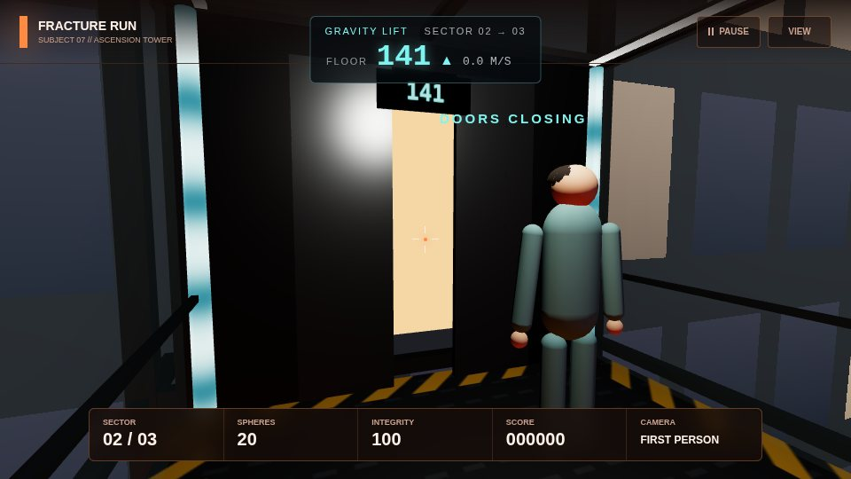
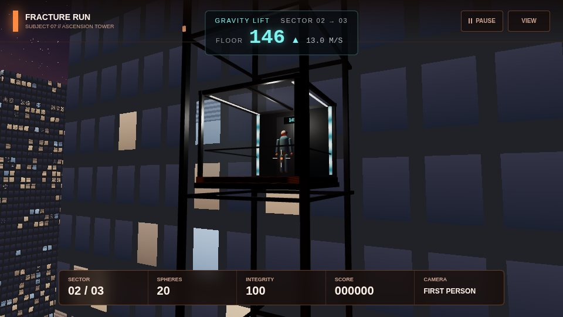
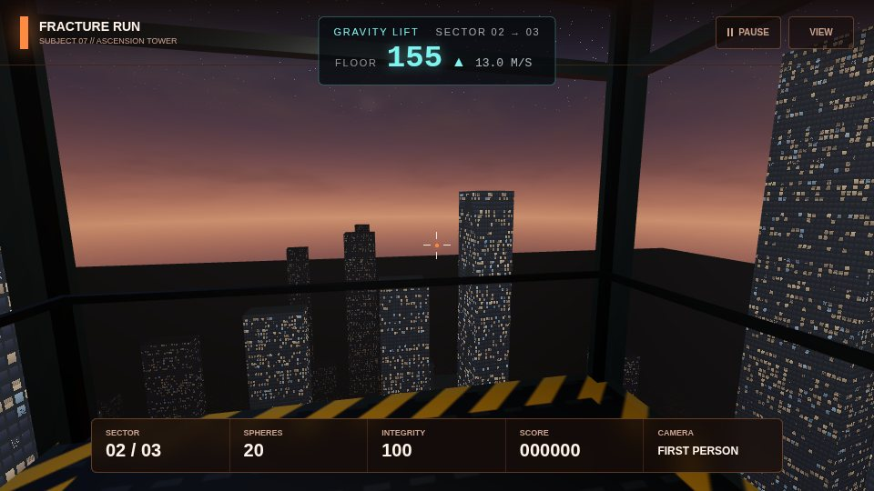

# The elevators

Ascension Tower's lifts connect the three sectors. From the project brief: *"A glass elevator connects the levels and acts as a playable transition rather than a loading screen."*

| Lift | Between | Status |
| --- | --- | --- |
| Calibration Lift | Level 1 → Level 2 | Done - part of the Causeway (`src/levels/causeway/`), see [`level-transition.md`](./level-transition.md) |
| **Gravity Fault** | Level 2 → Level 3 | **The ride is in** (this document). Gameplay - weak gravity, three stabilisers, diagnostic camera - is next |
| Meltdown lifts | Level 3 start, Level 3 → roof | Placeholders in `src/levels/meltdown/elevator.js`, to be replaced |

---

## 1. The Gravity Fault (Level 2 → Level 3)

### What the player sees

The Foundry's extraction valve breaks, the screen fades, and Subject 07 is standing in a glass lift with the Foundry's orange service door behind them.

| Time | What happens | Camera |
| --- | --- | --- |
| 0.0 s | Fade in. Floor 141. | **Doors** - from the front corner, looking back past Subject 07 as the doors close on the Foundry's glow |
| 0.4 - 1.6 s | Doors close | |
| 1.8 s | The lift launches up the outside of Ascension Tower (a jolt, `depart` event) | |
| 2.2 s | Climbing at 13 m/s, the floor counter racing | **Exterior** - outside, over the drop, swinging round the cabin as it climbs the tower |
| 5.8 s | | **Interior** - first person; move the mouse to look around at the burning city |
| 9.0 - 9.8 s | Fade out (`arrive` event) | |

Level 3 then opens with its own arrival lift (doors open on the burning ward).





### Next: the fault itself

Planned from the brief and agreed as the next steps:

1. **The fault.** Part-way up, the lift jolts, the lights go red, the energy conduits stutter (`uFault`), and gravity drops. Subject 07, glass shards and thrown spheres float inside the cabin.
2. **Three stabilisers** on the cabin frame to shoot. Spheres fly in slow arcs in the weak gravity - a preview of the floaty physics. Each hit steadies the lift; the camera cuts **interior → exterior → top-down orthographic diagnostic** view as they go down, and a picture-in-picture diagnostic monitor shows the orthographic view throughout.
3. **No fail state.** All three in time: gravity snaps back, everything floating drops, a score bonus, a smooth arrival. Out of time: the emergency brakes slam on, a hard arrival and no bonus. Either way the lift arrives in Level 3, which opens with the lift jolting to a stop - the two fit together.
4. Enough spheres guaranteed on entry that the player can never be stuck.

### How it is built

The ride is a self-contained module, like Level 3: its own scene, cameras and HUD, drawn with the game's renderer. It does not touch any level's code.

```text
src/elevators/
  gravity-fault.js   GravityFaultRide - timeline, cabin motion, camera shots, events
  kit.js             the world (sky, city, skyline, tower), the shaft, the cabin, the figure
  shaders.js         GLSL: facade windows and fire, sky, city lights, energy conduits
src/ui/
  elevator-hud.js    floor counter, speed, alert line
  elevator-hud.css
tests/elevators/
  run.js             check harness (and --shots for the images above)
  checks/gravity-lift.js
```

**Scene hierarchy**

```text
RideScene
|-- RideWorld          sky sphere, city plane, instanced skyline, Ascension Tower
|-- LiftShaft          four rails, instanced ring beams and marker lamps
|-- GravityLiftCabin   moves up +Y
|   |-- frame, glass, doors, floor display, energy conduits
|   |-- cabin light (point light)
|   `-- Subject07      jointed figure, hidden in first person
`-- moon, fire uplight from below, hemisphere
```

**Shaders** (`shaders.js`) - nothing outside the cabin uses a texture, so the ride has nothing to download while Level 3's models stream in:

| Shader | Technique |
| --- | --- |
| Facade | Windows are a grid in *world space*, so any box - the tower or an instanced skyline building - gets them for free. Per-window hash decides lit/unlit, warm/cool, blinds; floors below a *fire line* burn and flicker, with soot fading up the wall |
| Sky | Gradient, fire glow on the horizon, fbm storm clouds lit from below, stars, and a `uFlash` lightning uniform |
| City | Street grid, scattered lit windows and flickering fires on a plane far below |
| Energy | The brief's energy material: bands flowing up the conduits, edge glow, and `uFault` for the red stutter |

All four apply the same exponential-squared fog as the scene and include Three's tone-mapping and colour-space chunks, so they match the standard materials.

### How it plugs into `main.js`

The `GRAVITY LIFT` block in `main.js`:

```text
Foundry "complete" ─► state = "lift", transitionTarget = 3   (existing)
      │  0.6 s fade to black
      ▼
startGravityLift()
   · Level 2 hidden and disposed (was done on the way into Level 3)
   · Level 3's models start streaming (preloadMeltdown)
   · new GravityFaultRide({ renderer, spheres: ammo, reducedMotion })
      │  every frame: updateGravityLiftFrame() → ride.update(), ride.render()
      │  the fade overlay follows ride.fade
      ▼
finishGravityLift()          when ride.result.done
   · score += result.bonus, ammo = result.spheres
   · ride disposed
   · enterMeltdown()          (existing - Level 3 opens in its arrival lift)
```

- The pointer is forwarded with `ride.onPointerMove(x, y)` (the game's normalised pointer, so the sensitivity setting applies).
- Restart, quit and every demo jump call `leaveGravityLift()`, so a ride never outlives the run.
- **Demo key `5`** jumps straight into the ride from anywhere in a run. `__dbg.gravityLift` and `__dbg.demoGravityLift()` are there for the checks and the console.
- **Reduced motion** (Settings) calms the shake and the exterior camera's swing.

**Events** (`ride.events.on(name, fn)`) for the audio workstream: `shot` (`{ shot }`), `depart`, `arrive`.

### What carries over

| State | Carries? |
| --- | --- |
| Score | Yes, plus the ride's bonus (0 until the stabilisers are in) |
| Spheres | Yes - they become extra balls in Level 3, as before |
| Integrity | Level 3 resets it, as before |

---

## 2. Level 3's lifts (next)

Level 3's own lifts are placeholders and are meant to be replaced (see [`level-3-meltdown.md`](./level-3-meltdown.md), "The lifts"). The plan, keeping Level 3's `createLift()` API (`setDoors`, `setLight`, `setIndicator`, `dispose`) so nothing else in Level 3 changes:

- A proper freight lift model for the arrival and departure lifts.
- **Level 3 → roof:** instead of the doors closing to black, a glass freight lift climbing the outside of the burning building - fire and smoke below, the floor counter racing, the helicopter's searchlight sweeping past - before the doors open on the roof.

---

## 3. Testing

```text
npm install --no-save playwright
npx playwright install chromium
node tests/elevators/run.js            # checks
node tests/elevators/run.js --shots    # also regenerate docs/images/elevators/
```

| Check | What it proves |
| --- | --- |
| handover from Level 2 | The Foundry's real `complete` event starts the lift, Level 2 is disposed, the lift HUD shows |
| ride to Level 3 | Every camera shot plays, the cabin climbs, the ride finishes, is disposed, and Level 3 starts and is visible |
| restart and memory | Restarting mid-ride frees it; three rides in a row leave GPU geometry and texture counts unchanged |

Manual checklist before merging:

- [ ] Play from Level 2 (press `2`) to the end of the Foundry: the lift plays and Level 3 starts. No console errors.
- [ ] Press `5` during a run: the ride plays from the start.
- [ ] Press `Esc` during the ride: it pauses and resumes.
- [ ] Press `R` / *Restart run* during and after the ride: the run restarts in Level 1 with no lift HUD left on screen.
- [ ] `node tests/causeway/run.js`, `node tests/foundry/run.js`, `node tests/meltdown/run.js` and `node tests/elevators/run.js` all pass.
