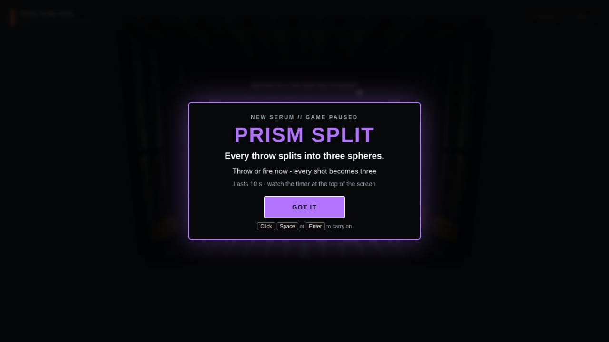
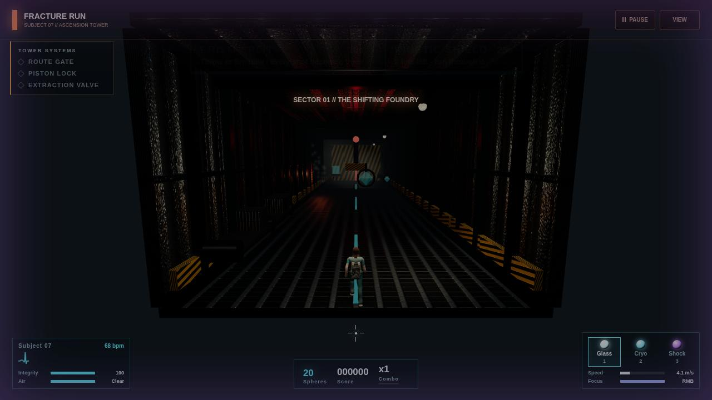
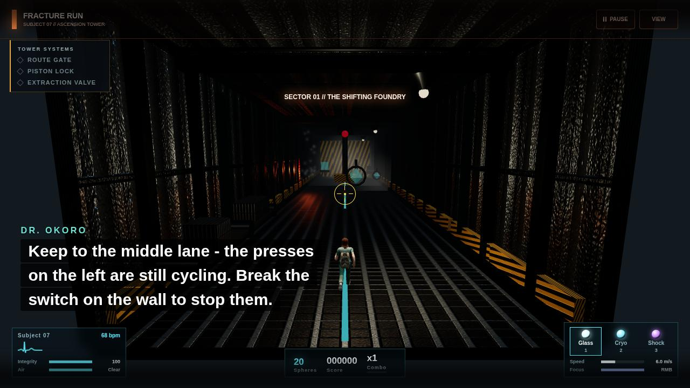
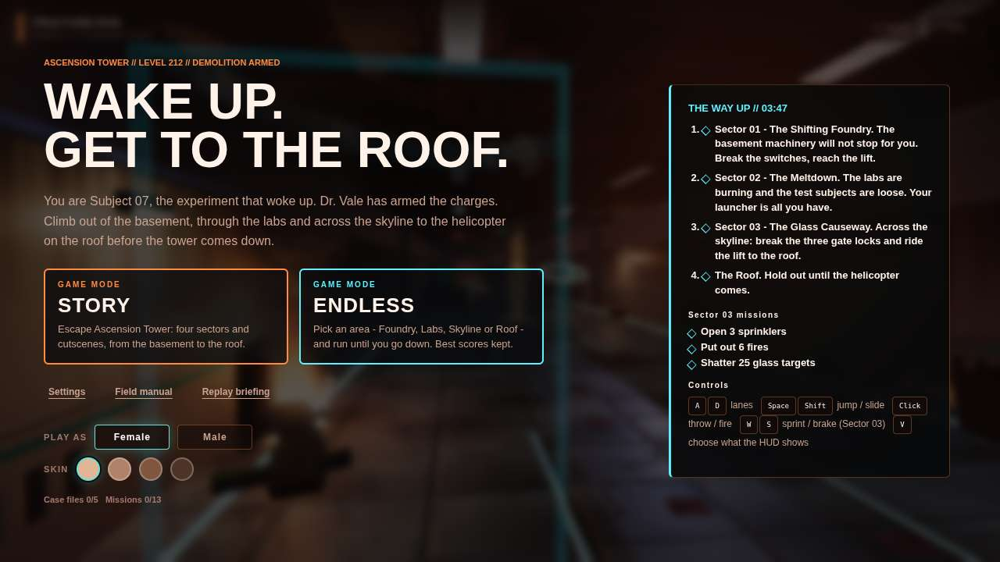

# Feedback round 1 - what was fixed

From the first CGV feedback meeting (the tester played part of the game; most notes were about the UI and the power-ups). Each fix below maps to a row of section 2 of the feedback document and its user story.

| # | User story | Fixed | Where |
| --- | --- | --- | --- |
| 1 | US1 - explain a power-up the first time | Yes | `src/ui/powerup-banner.js` |
| 2 | US2 - see clearly when a power-up is active | Yes | `src/ui/powerup-banner.js` / `.css` |
| 3 | US3 - subtitles easy to see and read | Yes | `src/story/story.css`, `src/ui/causeway-hud.css`, `src/ui/elevator-hud.css`, Settings |
| 4 | US4 - Story and Endless look like game modes | Yes | `index.html`, `styles.css` |
| 5 | US5 - a clean main menu | Yes | `index.html`, `styles.css` |
| 6 | US6 - Replay Briefing works | Yes (bug) | `src/story/story.css`, `styles.css` |

## 1 and 2 - Power-ups (serums)

All four serums (Prism split, Thermal sight, Kinetic shield, Overdrive) go through the one shared `Arsenal` (`src/systems/arsenal.js`), in every level. Its `activate()` now calls `onActivate(type)`, and `main.js` hands that to one `PowerupBanner`, so the Foundry, the Labs, the Skyline and the Roof all behave the same:

- **The first pickup of each serum pauses the game** (the same pause as Esc, without the pause menu) on a card in the middle of the screen: the serum's name in its colour, what it does, what to do with it now, and how long it lasts. *Click*, *Space*, *Enter* or *Esc* carries on. Each serum is explained once; the browser remembers which (`fractureRun.serumsSeen`). **Settings > Gameplay > Power-up tips > Show them again** resets it (useful before a demo).
- **While a serum is active**, a badge at the **top centre** shows its name, the seconds left, a bar running down, and what to do now ("Throw or fire now - every shot becomes three", "2 hits left - run through it"). The screen's edges glow in the serum's colour. Both pulse in the last two seconds. The old side panel is hidden (the View menu's *Active serums* switch now controls the badge).

## 3 - Subtitles

There are no voiceovers, so every subtitle is bigger, bolder and on a darker box: the cutscene subtitles, the lines during play (bottom left, clear of the runner), the Skyline's intercom and the lift-ride captions. **Settings > Accessibility > Subtitle size**: Normal, **Large** (the default) or Extra large - one CSS variable (`--sub-scale`) that every subtitle style uses. Line timing is unchanged (it is part of each cutscene's script).

## 4 and 5 - Main menu

- **Story** and **Endless** are two cards of the same size and style, each labelled *GAME MODE* with one line saying what it is.
- Below them, one small row: Settings, Field manual, Replay briefing.
- **Preview the Skyline** (a fly-through) moved into the Field manual, which is about the Skyline.
- On shorter screens (laptops, 1280x720) the headline is smaller so the whole menu fits without scrolling.

> **Merged with `feat/level3`:** the team kept the Level 3 branch's main menu (one list - Start story, Chapters, Endless, Field manual, Settings, Replay the briefing - beside the loadout card with the sphere picker), so the mode cards above are not in the merged game; the glitching headline is. The Skyline preview was removed on that branch, and the Field manual became tabs per sector (Spheres & serums, Foundry, Labs, Skyline, Roof), each card keeping its *Break it / Avoid it / Collect it / Your tool* tag and the BACK at the top.
> The first-pickup serum card is restyled there too: the capsule itself, turning in a ring of its colour, beside the name, what it does, how long it lasts and what to do. After that first card, the HUD's serum chips at the top centre (`src/ui/serum-fx.js`) show the time left, in place of the badges.

## 6 - Replay Briefing (bug)

Two causes:

1. `src/story/story.css` styled `.story-title` (and `.story-skip`) for the cutscene layer, but the first screen's "FRACTURE RUN" heading uses the same class - so it became an invisible full-screen layer over the buttons, and swallowed the clicks. The story styles are now scoped to `.story-layer`.
2. On the main menu the button row ran underneath the briefing card on the right (at 1280 and 1366 wide), so *Replay briefing* could not be clicked. The menu now keeps clear of the card.

Checked at 800x600, 1024x700, 1280x720, 1366x768, 1600x900 and 1920x1080: every button on the first screen and the menu is clickable (nothing on top of it).

## Tests

`tests/causeway/run.js` now marks every serum as already explained before it starts: its bot cannot dismiss the first-pickup card, so the paused game stopped the *endless* and *playthrough* checks short.
