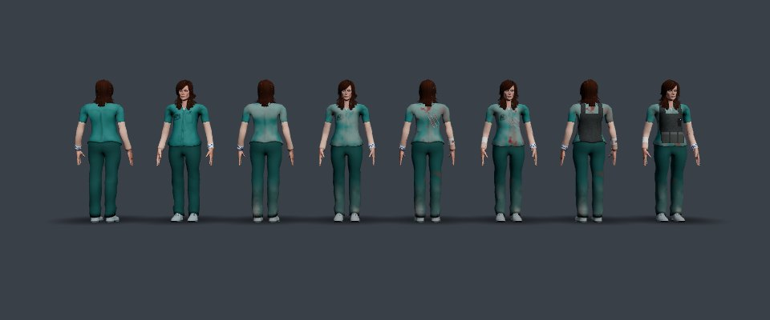
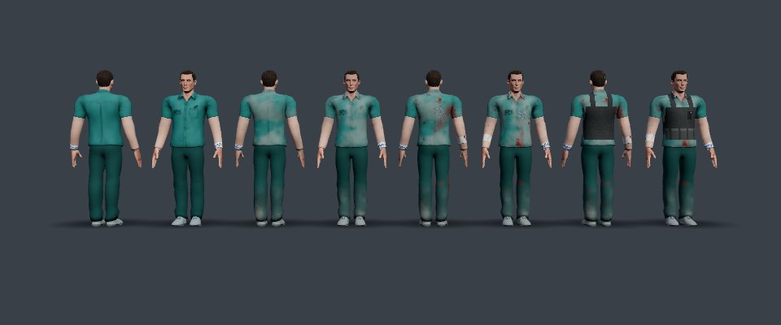
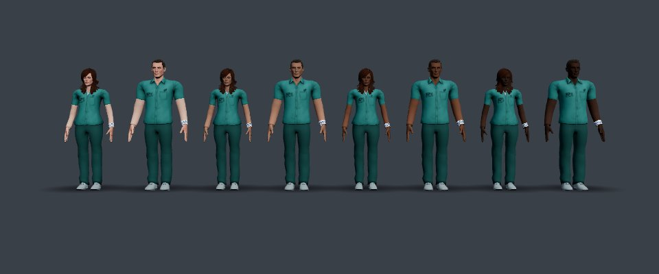

# The figure and its wear shader

The player figure from Tebogo's task sheet (the team's new storyline): the last surviving test subject of an illegal underground lab, kidnapped from the city, woken in the basement ward by the one good scientist. What they wear, and what the escape does to it, is drawn by **one shader driven by one value, `wear`, and one switch, `gear`**.

Code: [`src/figure/look.js`](../src/figure/look.js) · used by every level through Level 3's `PlayerAvatar` ([`src/levels/meltdown/player.js`](../src/levels/meltdown/player.js)) · the scrubs' colours stay in [`src/levels/meltdown/characters.js`](../src/levels/meltdown/characters.js).




## The look

- **The lab subject:** short-sleeved patient scrubs, a hospital wristband on the left wrist (the subject number drawn as rows of dashes), an IV port inside the right elbow.
- **The civilian detail:** their own grey t-shirt, still on under the scrubs - a V of it at the neck, and it shows through every tear. The last piece of the life they were taken from.

## The stages

| Stage | Set by | What changes |
| --- | --- | --- |
| **Clean** - waking in the ward | `wear` 0 | Nothing: clean scrubs |
| **Dusty** - the basement | `wear` 0.33 | Patches of concrete dust over the scrubs, skin and shins; grime |
| **Bloodied and scratched** - the mutant lab | `wear` 0.66 | Claw rips (three parallel slashes: across the left of the chest, down the right of the back) with the t-shirt showing through and blood at the edges; blood spatter; blood soaked in below the rips; scratches on the forearms; blood at the knees; a gauze bandage round the right forearm |
| **Geared up** - after the scientist's sacrifice | `gear` on | His vest over the scrubs: dark panels front and back, three pouches low on the front, straps over the shoulders, and his radio on the left of the chest with a green light |

The game sets them by **story position** (`figureStage(position)` in `look.js`, fed with the sector number): waking = clean, Sector 01 (the Foundry) = dusty, Sector 02 (the Labs) = bloodied, and the gear from the Labs' lift - where the scientist stays behind - onwards: the quiet ride, Sector 03 (the Skyline) and the Roof. `main.js` sets it every frame for its player body (`storyPosition()`), gives each lift ride its state (the Gravity Fault out of the Foundry: dusty; the quiet ride: geared up), and dresses Level 3's body for the Labs or the Roof as it enters them (`dressMeltdownAvatar`).

```js
avatar.setWear(0.66);   // PlayerAvatar
avatar.setGear(true);
```

## Skin tones

The player picks one of four skin tones on the start screen (the round swatches under *Play as*): **light** (the models' own), **medium**, **brown** and **dark** (`SKIN_TONES` in `look.js`). The choice is saved in the browser (`fractureRun.skinTone`) and applies everywhere the figure appears - Levels 1 and 2, the lift rides and Level 3.



It is the same shader, not new models or textures: on the body's atlas cell, pixels that are **warm** (red above blue and green - skin, not the grey whites of the eyes or the teeth) are replaced by the chosen tone, scaled by the pixel's brightness relative to the model's own average skin. So every shadow, crease and the lips keep their shape, and the painted skin (the short sleeves, the scratches, the dust) uses the same tone (`skin = mix(uSkin, uTone, uToneOn)`).

```js
avatar.setSkinTone("dark");   // PlayerAvatar; "light" restores the model's own
```

## Inputs (uniforms)

| Uniform | What it is |
| --- | --- |
| `uWear` | 0..1 - the damage (0 clean, 0.33 dusty, 0.66 bloodied) |
| `uGear` | 0 or 1 - the scientist's vest and radio |
| `uSkin` | the model's skin tone, averaged once from its own body texture, so painted skin matches real skin |
| `uTone`, `uToneOn` | the chosen skin tone, and whether it replaces the model's own (0 for "light") |
| `uCellTop`, `uCellBody`, `uCellBottom`, `uCellShoes` | each clothing texture's rectangle in the character's texture atlas - how a pixel knows what it is |
| `uShoulderX`, `uShoulderY`, `uArmLength`, `uHipY` | body measurements from the rig (characters.js `measureBody`) |
| `uNeckY` | the top of the scrub top (its neckline), measured from the mesh |
| `vRest` (varying) | the pixel's position on the body in the **rest pose** - before the rig bends the arms and legs |

## How it works, block by block

The shader is not a separate material. `applyFigureLook` chains onto the rig's `onBeforeCompile`, so the figure is still one mesh, one material, one draw call. It adds three things to Three.js's standard shader:

**1. Vertex: the rest position.** `vRest = position;` - the vertex position straight from the geometry, before the rig moves it. Every mark on the body is placed in these coordinates, so the wristband stays on the left wrist however the arm swings.

**2. Fragment header: helpers.**
- `inCell()` tests which atlas rectangle a UV is in.
- `n3()` is 3D value noise (random values on a grid, smoothly blended between the corners); `fbm3()` adds three octaves of it for blotchy, natural patterns. The dust, blood and grime are all this noise sampled at `vRest`.
- `claw()` draws three parallel slashes: it measures the pixel's distance *along* and *across* a direction; near one of three evenly spaced lines, within a length that grows with the stage, it is inside a slash. The width wobbles with noise so the edges are ragged.

**3. Fragment body: after `map_fragment`.** Three.js has just read the texture into `diffuseColor`; the look changes that colour before lighting, so every mark is lit like the rest of the figure. Two stage weights are computed first - `dusty` rises from wear 0.08 to 0.33, `bloody` from 0.4 to 0.66 - and every effect is scaled by one of them. Then, in order:

- **Where on the body.** `along` measures how far along an arm the pixel is (0 at the shoulder, 1 at the fingertips); `left` and `front` say which side. `grain` is noise shared by several effects.
- **Short sleeves.** Past 20% of the arm the scrub top is painted as bare skin, with a darker band for the hem.
- **The t-shirt at the neck.** A narrow V below the neckline, on the front, is the grey t-shirt.
- **Dust.** `smoothstep(low, high, noise)` turns noise into patches. Both thresholds drop as `dusty` rises, so more of the noise field passes and the patches spread - that is how one number grows the damage.
- **Claw rips.** `claw()` scaled by `bloody`: the slashes lengthen as the stage comes in. Inside: the t-shirt. At the edge: blood.
- **Blood.** Spatter (high-frequency noise above a threshold that drops with `bloody`) and a soaked patch on one side, below the rips.
- **The vest** (`uGear`): a band over the torso and two shoulder straps, not the arms. Pouches repeat across the front using `fract()`; the radio is a small box with a bright green dot (bright enough to glow with the game's bloom).
- **Skin.** Dust and grime on the face, neck and bare arms; thin red scratches across the forearms (lines from a `fract()` pattern, broken up by noise so only some show); a little blood.
- **Wristband, IV port, bandage.** Painted by position on the arm: the band and its dashes at 63% along the left arm; the port's dressing and white cap inside the right elbow; gauze stripes and a blood spot round the right forearm from the bloodied stage.
- **Trousers and clogs.** Dust up the shins, blood at the knees, scuffed clogs.

**4. Emissive.** Level 1 makes the figure faintly self-lit so it reads in the dark halls, using the texture as its glow. After `emissivemap_fragment` the glow is set to `emissive × diffuseColor` - the damaged colour - or the clean scrubs would shine through the dust and blood.

**A detail worth knowing for questions:** `smoothstep(a, b, x)` is only defined in GLSL when `a < b`. To fade the other way, the shader writes `1.0 - smoothstep(a, b, x)` rather than swapping the edges, which some GPUs get wrong.

## Why tears are painted, not cut

An alpha cut-out - discard the pixels of a hole - would show empty space on these models: they have **no body under the clothes** (the scrub top is the torso's surface). So a tear *paints* what is underneath, the t-shirt, which reads the same from the game camera and fits the story better.

## Next

- The optional experiment glow (if the team keeps powers) would be one more block here: pulsing emissive veins driven by time and a power value.
- The good scientist is a separate character; this shader is for the player only.
