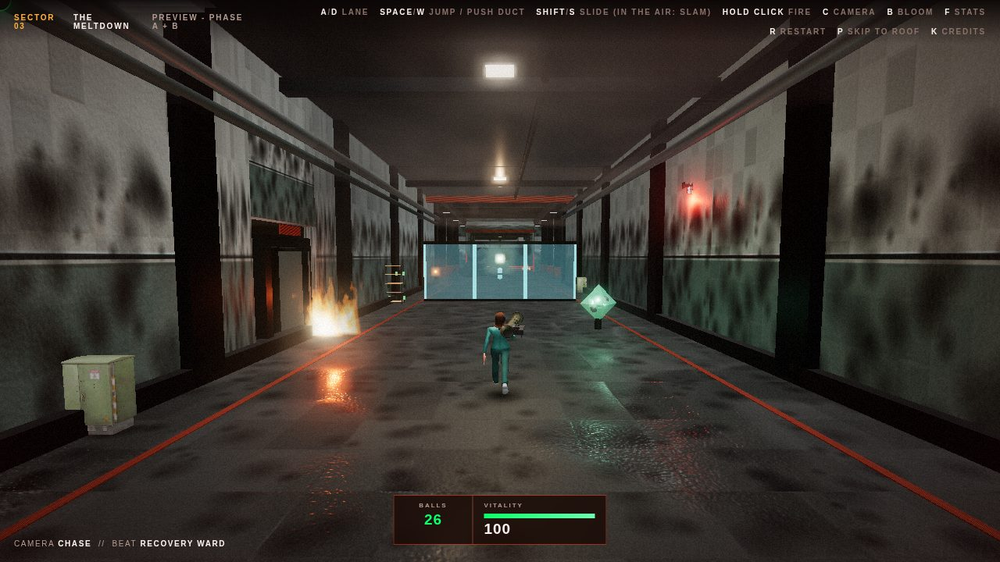
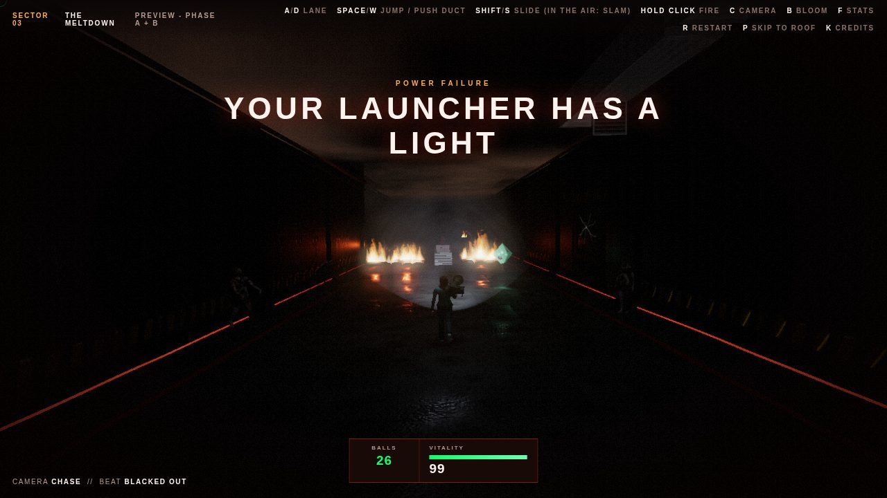
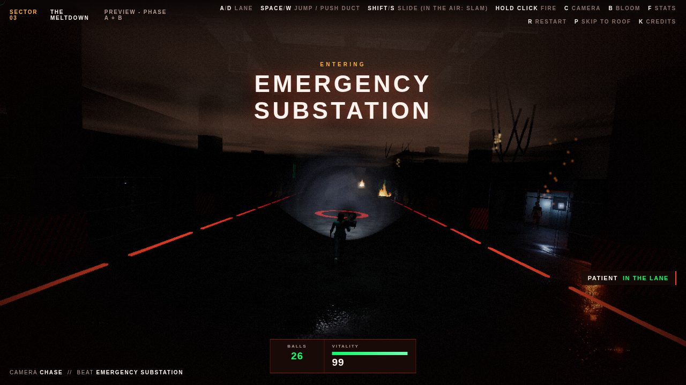
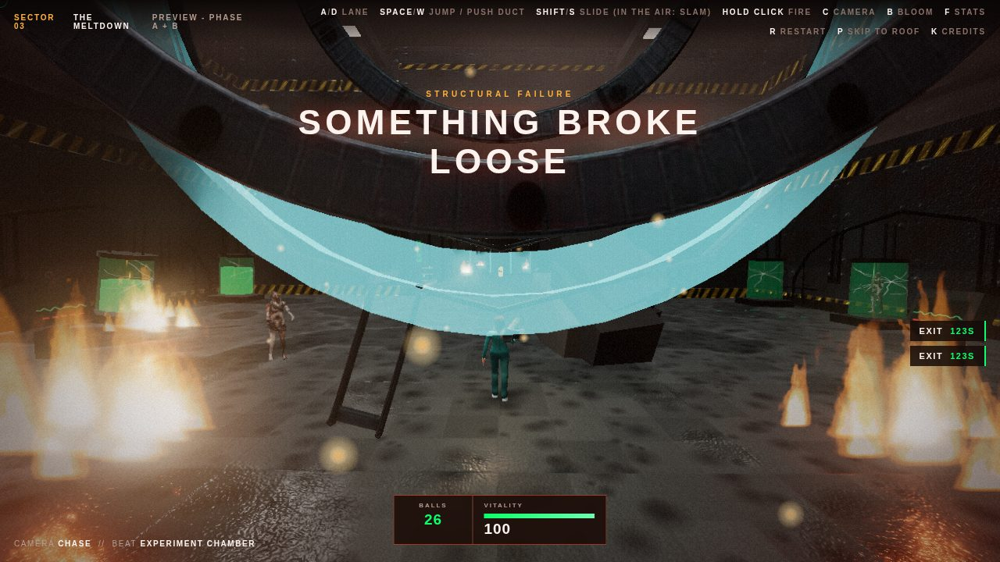
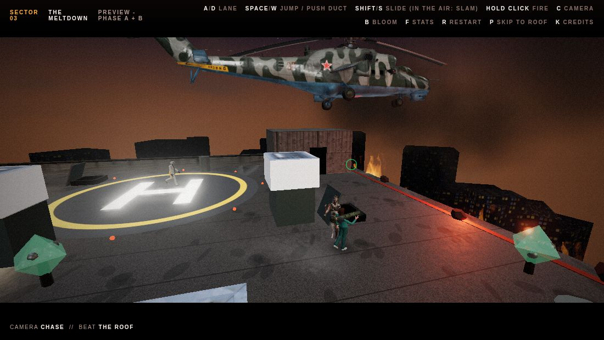
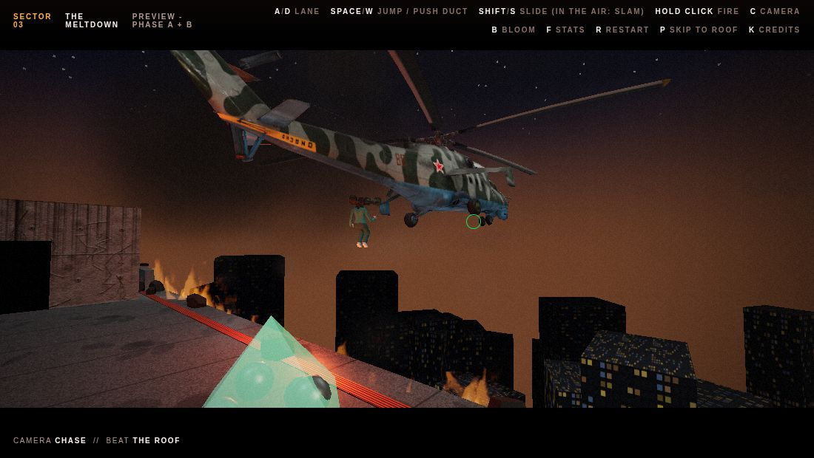

# Level design sheet - Level 3: The Meltdown

Owner: Level 3 workstream
Status: **Phase A (the escape) and Phase B (the roof) are both built** and play end to end in the standalone preview. Integration into `main.js` is pending (the same stage Level 2 reached before its integration). Supersedes the "Inverted Core" gravity/boss concept in `project-brief.md` §5; see "Relationship to the project brief".

**Run it:** from the repo root, `python -m http.server 4173`, then open `http://localhost:4173/preview/meltdown.html` in Chrome, pick a patient and click to start. Hard-refresh (`Ctrl+Shift+R`) if you have opened it before. `?roof` in the URL (or `P` in game) skips straight to Phase B.

**Controls, Phase A:** `A`/`D` lane - hold left mouse to fire (it overheats) - `SPACE`/`W` jump, or mash it at a fallen duct - `SHIFT`/`S` slide (in the air: slam down into it) - `C` camera (chase / first person / cinematic / orbit) - `B` bloom - `F` stats - `K` credits - `R` restart.
**Controls, Phase B:** `WASD` move - mouse aim, hold left mouse to fire - `SPACE` dodge.

**Check it:** `node tests/meltdown/run.js` (see "Testing").

---

## 1. One-sentence distinction test

> Level 3 is about staying ahead of a fire that never stops closing in - through a building that goes dark halfway - then surviving an unknown length of time against people trying to stop you getting off the roof.

Level 1 is aiming and ammunition. Level 2 is dodging and switches that reshape the route. Level 3 is **pressure with no way to fully clear it**: the fire in Phase A never turns off the way Level 2's pistons do, the blackout takes away your sight line, and the helicopter in Phase B never gives you a countdown to plan around.

---

## 2. Story framing

You regain consciousness mid-collapse: sirens, smoke alarms, the building coming apart. You were a test subject here - you are still in patient scrubs. The lab staff triggered a self-destruct to destroy evidence before the FBI arrives. A failed experiment - a ball launcher - is the only tool at hand. You climb from the sub-level where the tests happened to the roof, where a rescue helicopter is inbound. When the experiment's ring tears reality open, it takes the building's power with it. The other test subjects are loose in the halls. The scientists responsible are on the roof, waiting for their own way out.

### Relationship to the project brief

`project-brief.md` describes Level 3 as "The Inverted Core" - a gravity-flipping arena with a reactor boss. This design keeps the brief's *intent* (spatial disorientation, a memorable final set piece) but delivers it through the reality-warp at the experiment ring, the blackout, and the rooftop encounter. The project brief's Level 3 section and rubric table should be updated once the team signs off.

---

## 3. Phase A - the escape (as built)

### Layout

Four beats joined by three 90-degree turns (Level 2's arc math, reused from `src/levels/foundry/route.js`), 952 m in total. The route, beats and halls are data (`BEAT_SPECS`, `HALLS` in `src/levels/meltdown/index.js`): add a beat and the route, turns, signage and patterns follow.

| Beat | Halls | Wall finish | Tier | Speed |
| --- | --- | --- | --- | --- |
| A - Recovery Ward | Recovery Ward, Research Lab | Clinical tile with grime | 1 | 8.2 m/s |
| B - Containment Corridor | Containment Block, **Experiment Chamber** | Riveted steel, hazard chevrons | 2 | 11 m/s |
| D - **Blacked Out** | **Emergency Substation** | Steel, unlit | dark | 9.4 m/s |
| C - Stairwell Ascent | Records Archive, Boiler Hall | Stained, cracked concrete | 3 | 14 m/s |

Halls are 44 m long, 32-36 m wide and 11-17 m tall (the corridor is 14 m wide and 8.4 m tall). Each is dressed to what it was used for - bed bays and restraint gurneys, lab benches and microscopes, holding cells with occupied specimen tanks, the experiment ring, burning archive shelving, boiler pipework - and the new one:

- *Emergency Substation* - banks of switchgear cabinets (a few doors hanging open, some still arcing), caged transformers, sagging cable trays, dead work lamps, battery strips on the floor, smoke banked low. And people standing in the dark between the cabinets.

Corridors carry per-beat finishes, real openings cut into the walls (windows, doorways, blown-out breaches - dark rooms in the blackout), and dressing whose fire density rises beat by beat.

### The blackout (beat D)

The ring's warp takes the power out. Through the doorway after the Experiment Chamber the lights die: the first few fittings sputter blue-white as their last charge drains, then there is nothing but dim red battery lamps every so often, red emergency strips along both kerbs marking the lane edges, sparks off torn cables and arcing switchgear, green exit signs, and fire. Smoke hangs low overhead.

- **The launcher is your light.** A spot beam from the muzzle follows the reticle (held a little low, like a weapon light, so aiming down the corridor also lights the floor you are about to run on). A custom cone shader scrolls world-space noise through the beam, so what you see lit is the smoke it passes through. The beam fades near the eye so it never fills the first-person view.
- **Balls are flares.** They glow brighter in the dark, and point lights ride the two newest balls in flight and linger a moment where they land - firing down the corridor is scouting.
- **Darkness is real, not a filter.** The level reports `darknessAt(distance)`; the ambient light, the pooled lamps, the travelling fill on the player (down to a faint cool spill so you can still see yourself), the chasing fire's glow (smothered by smoke - you see the flames behind you, but they do not light the way), environment reflections on metal (which would otherwise keep steel shining in total dark - see `createEnvironmentDimmer`), fog colour and the grading pass's vignette all follow it.
- **Hazards:** fewer than the corridor before it but harder to read - lasers and vents announce themselves; rubble, glass and patients have to be found with the beam. Set pieces: a reinforced pane in the dark, a patient straight ahead, the mandatory duct-bridge crossing lit only by the fire under the gap, two patients stepping out together, a fallen duct at the exit.
- **Watchers:** patients standing motionless against the walls. The first time the beam finds one they jerk their head up at you (with a stinger), then turn and walk off into the dark. Never a hazard.
- **Audio:** the power dies with a wind-down and a relay slam, the siren chokes, the beam clicks on; emergency power brings the siren back at the stairwell.

### Obstacles

Every obstacle is placed as a **pattern** that forces a decision (a single hazard in one lane is trivially dodged by standing in another).

| Obstacle | Answer | Notes |
| --- | --- | --- |
| Concrete barrier | Jump | |
| Hanging hazard beam | Slide | |
| Rubble wall (sometimes burning) | Change lane | Too tall to jump |
| Falling ceiling chunk | Dodge, then jump the rubble | Red landing ring telegraphs it |
| Fallen air duct | **Stops you** - mash Space x6 | Every second pushing, the fire gains |
| Floor gap, fire burning up through it | Jump | |
| Mandatory gap + fallen-duct bridge | Take the duct's lane | |
| Pendulum weight | Lane timing | |
| Security laser grid - low / high / sweeping | Jump / slide / time it | |
| Erupting fire vents | Lane or timing | Grates glow before each burst |
| Toppling shelf | Far lane, or jump it once down | |
| Rolling gas cylinder / sliding lab desk | Jump or time it | |
| Glass pane | **Shoot it**, or crash through (a hit) | 1 / 2 / 3 hits by tier; the roof door is the last |
| **Lurching patient** | **Shoot them down (2 hits)**, or be in another lane | They stand against the wall until you are 22 m away, then step out into a lane and stay there, arms out. Shot down, they fall back and stop blocking. Tiers 2, 3 and the blackout. |

**Fairness is verified, not assumed.** `tests/meltdown/checks/fairness.js` forces every falling piece down and every patient out into their lane (the worst case), then sweeps every cluster across 3 lanes x 3 poses (run, jump apex, slide) x 0-5 s of animation with the game's own `collide()`: **46 clusters, 0 impassable** (31 need the right lane, 10 a jump or slide, 5 a shot).

### The player

- **Your patient.** Pick on the start screen: Patient 0417 (female) or 0932 (male), both the supplied SCP models recoloured to teal patient scrubs (on the texture atlas, see §6). Remembered between visits. The default is 0417.
- **The models are not rigged**, so their skeleton lives in the vertex shader (`rigPlayerMesh` in `characters.js`): hip, knee, shoulder and elbow pivots are *measured from the mesh's own silhouette*, and legs, arms and torso rotate about them. Stride and cadence follow running speed, arms swing against the legs, the launcher arm is held up (higher while firing), knees tuck in a jump, the body drops and leans back in a slide, and the whole body leans into lane changes. A soft contact shadow grounds it.

### The fire

- **Custom GLSL fire** (`fire.js`): instanced camera-facing flame quads, one draw call per fire; fractal noise scrolled upward, shaped into licking tongues, through a black-body colour ramp that stays orange except in the hottest part (stacked tongues used to clip to white). About 2.5 tongues per square metre - less overdraw than before on a fill-rate-bound game.
- **The fire front** chases you, its distance behind you **is** your vitality (`4 + vitality x 0.42` m), and it throws embers forward at you. When you stumble, the camera swings round to show it gaining.
- **Smoke ceiling** (`smoke.js`): three noise-shaded sheets travelling with the player just under the ceiling, thicker as you climb, and banked down to a few metres overhead in the blackout.

### Physics you can see

- **Balls are real projectiles** (`effects.js`): pooled, launched from the muzzle toward the reticle under gravity, ray-swept each frame so they cannot tunnel through thin glass.
- **Breakage:** pooled shards with velocity, spin, gravity, bounce and friction - now drawn as one instanced mesh per material, so a 70-shard pane is one draw call, not seventy. Sparks, dust, cracks on reinforced glass, debris and camera shake from landing hazards, your dropped balls spilling out when you stumble. Balls into a patient: an impact, a burst and a stagger, then they fall.

### Movement and camera feel

- **Lane changes** are a critically damped spring, solved exactly (not integrated), so they start fast, never overshoot, and stay stable at 20 fps. A second tap mid-change carries the momentum on.
- **Jumps** rise under normal gravity and fall under heavier gravity - snappier, same 1.5 m apex the colliders are tuned for. **Input is buffered** (0.16 s): a jump pressed just before landing still happens; slide pressed in the air **slams** you down into the slide. A jump cancels a slide.
- **Chase camera** is a spring (it glides through the 90-degree turns instead of cutting the corner), pulls back a little with speed, widens its FOV from 72 to ~79 degrees flat out, dips on hard landings, and leans a touch into lane changes. First person gets a stride bob and a swaying viewmodel. All of it is skipped or scaled down under reduced motion.

### Player rules (host-side, in the preview)

| | Value |
| --- | --- |
| Vitality | 100. Passive drain 0.35 / 0.55 / 0.4 (dark) / 0.8 per second by beat (~47 lost over a clean run). A hit: -14, -6 fire burst, drop 25% of balls, 1.1 s mercy window. So two to three hits survivable. |
| Hidden timer | 124 s (~1.3x a clean run). Never on the HUD - only on evac signs as you pass them. |
| Balls | Start 26, max 45. Sacks: +5 / +6 / +7, taking 1 / 2 / 3 hits by beat. |
| Launcher | Hold to fire, ~7.5 shots/s. +9 heat/shot, cools 16/s. At 100: 3 s lockout, then 6 s weakened (half-power shots). |
| Power-ups | Coolant (clear heat, 4 s no heat), Adrenaline (6 s drain pause), Overcharge (next 6 shots break anything), Barrier (5 s hit immunity). |
| Speed | Per beat: 8.2 / 11 / 9.4 (dark) / 14 m/s, eased between. |

Only balls and vitality are persistent on screen. Heat shows on the launcher itself and the reticle.

### Visual approach

- **Grading pass** (`post.js`, runs last): heat haze rippling up from the bottom of the screen as the fire closes in, a chromatic split on a hit, a vignette that closes in with danger and in the dark, per-frame film grain (which also breaks up banding in the smoky near-black).
- **Wet floors:** a puddle roughness map (gloss where the sprinklers and burst pipes left water) lets the fire, alarms and beam reflect in the floor.
- Bloom at half resolution with a high threshold; a low-strength environment map so metal reads; danger pushes fog and ambience toward red; pixel ratio capped at 1; lights pooled at a fixed count; no transmissive materials.

---

## 4. Phase B - the roof (as built)

Through the roof door the screen fades to black, the corridor is hidden, the roof comes up (its shaders compiled while the screen is black) and you walk out of the stair hut. Vitality carries over with a +25 refill; balls carry over.

### Setup

A helipad rooftop at night (`src/levels/meltdown/roof.js`), 32 x 32 m. Parapets north and south; the **east and west parapets have collapsed** - a painted warning line, rubble on the lip, and fire climbing the facade below, flames licking over the edge. Cover: four AC units, a water tank, vents, the stair hut you came out of, and the machine room. Three ball sacks. Around you, the city is lit below in the smoke, under a sky shader (orange at the horizon from the fires, drifting smoke, a few stars).

### Enemies

Two waves, each a **scientist** who lets two **patients** out of the roof hatches. The second wave comes out of the machine room when the first is down, or after 19 s regardless.

- **Scientists** (the Radioman and Rust models, each with a supplied gadget in hand - brass for one, the coil rifle for the other): keep 9-13 m away on a ring around you, off the ledges. Telegraph (the gadget glows for 0.85 s), then fire a slow orb (11 m/s) aimed a little ahead of you - standing still is how you get hit. 3 hits to put down; a hit spoils a shot being lined up.
- **Patients** (melee rushers): stalk you, and when they have a clear line inside 12 m they **wind up** (crouch, scream, arms thrown back - 0.62 s) and **charge** in a straight line at 10 m/s, direction locked at the end of the wind-up. Connect: -14 and knockback. Miss into cover or a parapet: stunned for 1.5 s - shoot them now. **Miss near an open ledge: they go straight over it**, a kill that costs no balls. 2 hits to put down.
- All animation is procedural on the models' real skeletons (`HumanoidRig`, §6).

### Helicopter timer

Hidden, randomised per attempt in 25-45 s. The only tells are the rotor sound (a chopped, filtered noise bed that swells over the last 16 s) and, from 12 s out, the helicopter itself flying in over the city. **Clear the roof and it stops circling**: it arrives within 8 s.

### Endings

1. **All enemies defeated -> victory ("EXTRACTED").** The helicopter sets down over the pad, the camera orbits, you walk to the open door and climb in, and it lifts away.
2. **The helicopter arrives with enemies still alive -> survive ("BARELY OUT").** It cannot land. It slides out beyond the east ledge and starts to pull away; you sprint for the edge and jump - slow motion over the gap - catch the skid, and are carried off over the burning city.

Both are letterboxed, scripted cutscenes: the level returns where the camera is and looks, and where the player is and what they are doing, and the host applies it (the same data-driven pattern as the `state === "launch"` intro in `main.js`). Losing is the same as elsewhere: vitality to 0 ("THEY GOT YOU").

### Controls on the roof

`WASD` moves relative to the camera (high and behind, looking north over your head, leaning toward your aim). The mouse aims - over an enemy or sack, at them; otherwise at chest height on the roof. `SPACE` is a **dodge**: a quick sidestep (13 m/s for 0.24 s) with 0.32 s of invulnerability, 0.75 s cooldown. It is how you make a charge miss - and near a ledge, how you make it fall. You cannot fall off yourself.

---

## 5. Audio (as built)

Everything is synthesized live with the Web Audio API (`src/audio/meltdown-audio.js`) - no sample files, nothing to credit, and every bed reacts to game state.

| Cue | Behaviour |
| --- | --- |
| Building siren | Two detuned saws swept by a slow LFO; louder with danger; chokes in the blackout, returns with emergency power |
| Smoke detectors, fire roar, crackle, heartbeat | As before: swell with danger and the fire front's distance |
| Launcher shot, glass crack/shatter, crash, clang, stumble, pickup, power-up, overheat, duct push, warp | One-shots |
| Power failure / power up / beam on | Wind-down and relay slam; spin-up; a click and a faint high whine |
| Patients | A rising moan as one steps out, a thud per ball, a body hitting the floor, a growl before a charge, a scream over the edge |
| Stinger | When the beam finds someone standing in the dark |
| Rotor | Filtered noise chopped at blade rate plus turbine whine, swelling as the helicopter nears |
| Gadget zap, dodge whoosh | One-shots |

Spatial positioning (`PannerNode`) is still to do.

---

## 6. Characters and models

All supplied models are converted with `tools/assets/convert.py`; sources and licences are in `docs/credits.md`, and the CC-BY ones are credited **in game** (`K`, `src/levels/meltdown/credits.js`).

The character models arrive in four conventions (Z-up and Y-up, metres and centimetres, T and A poses, Mixamo / Valve / custom skeletons, one to eleven materials each) and none has an animation clip. `src/levels/meltdown/characters.js` makes them one kind of thing:

1. **`prepareCharacter`** stands the model up, faces it down +Z, scales it to a real height from its *bones* (mesh bounds lie), puts its feet on y = 0, and repairs broken bones (the patient's hand bones sit 200 m from its wrists - a unit error in the export).
2. **`atlasMerge`** paints every material's colour texture into one runtime canvas atlas (with padding and bleed so mipmaps do not leak between cells) and merges every mesh into **one** skinned or static mesh: a character is one draw call instead of up to eleven. The scrubs recolour is done here, with canvas blend modes on the atlas cells.
3. **`HumanoidRig`** is procedural animation for any skeleton: bones are found by name across naming conventions, and every rotation is authored in the character's rest *model* space and converted into each bone's local frame (`local = restParent^-1 * R * restParent * restLocal`). One run cycle drives a Mixamo rig and a Valve biped alike; T- and A-posed arms are lowered by measuring their rest direction.
4. **`rigPlayerMesh`**: the vertex-shader rig for the unrigged player models (§3).

The helicopter (`helicopter.js`) is a Hind gunship model: its cannon, missiles and rocket pods are left out, the airframe is merged into one mesh, and the main and tail rotors are split out onto pivots so they spin.

`scientist_colossus.glb` is **not used**: its textures carry Nazi insignia (a swastika and eagle on the helmet, Balkenkreuze, swastikas on the ID badge and boots). See `docs/credits.md`.

---

## 7. Performance

Measured with `renderer.info` on a single scene render at points along the route (headless, so the counts are meaningful; timings are not):

| | Before this pass | After |
| --- | --- | --- |
| Draw calls, busiest point | ~510 | ~270 |
| Typical | 270-550 | 200-300 |

What did it: corridor dressing baked into 40 m chunks (one mesh per material per chunk, like the halls); the imported models merged per hall/chunk once they are swapped in (`bakeFilled` - the containment hall's fence panels alone had been over a hundred calls); static hazards baked per piece; instanced debris; one draw call per character; fewer fire tongues. Also: **every shader is compiled and every texture uploaded during loading** (`level.prewarm`), instead of on the frame something first comes into view at running speed; the Phase B swap compiles behind the black fade; models are cached so a restart does not reload them. The scene's light count never changes during a phase (the beam, flares and helicopter searchlight exist from the start at zero), so nothing recompiles mid-run.

---

## 8. Testing

`tests/meltdown/run.js` (Playwright + headless Chromium; `--shots` regenerates the screenshots in this doc). Three checks:

- **route** - builds the level and steps it along all 952 m: every beat, hall, sign, fall, warp and completion event fires once, every patient lurches, the dark beat is dark (and nothing else is).
- **fairness** - the sweep described in §3.
- **roof** - Phase B simulated without the host: both waves spawn; a player sidestepping charges by the east ledge sends patients over it; standing still gets you hit by orbs and charges; clearing the roof ends in victory with the helicopter coming early; the timer running out ends in survive; both cutscenes finish; the timer varies within 25-45 s.

Where jsDelivr is unreachable, point `MELTDOWN_THREE_DIR` at an unpacked `three@0.160.0` npm package (see `tests/meltdown/lib.js`).

**Still not done: a real human playtest.** Everything above is proven *possible* and scripted end to end, not proven *fun*. The numbers most worth watching when someone plays it: the blackout's speed (9.4 m/s) and beam angle, the drain total (~47 on a clean run), the patient charge speed and wind-up (0.62 s), and the helicopter window.

---

## 9. Open questions

- Balance is first-pass (see above).
- One summary screen with two titles (as built), or two different end screens?
- Top speed (14 m/s) exceeds what Level 2 found readable (13.2). Deliberate for the final beat, worth watching.
- Four of the supplied models are fan recreations of commercial franchises (see `docs/credits.md`). Fine for a university project; swap before any public release.

---

## 10. Still to do

- **Credits:** fill in source and licence for the four **TODO** rows in `docs/credits.md` (ventilation kit, Javelin, alarm light, geothermal factory) and confirm the Poly Haven rows.
- **Integration** into `main.js` - see `docs/level-3-handoff.md` §7.
- **Playtest and balance pass.**
- Spatial audio.
