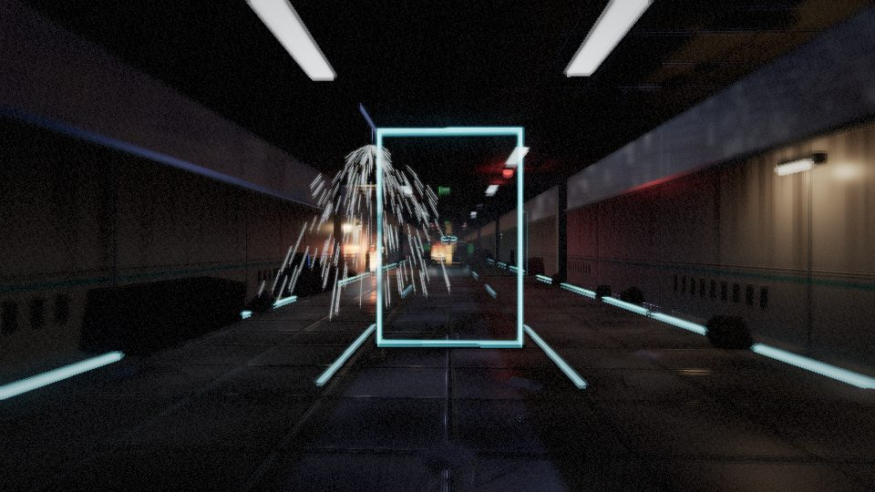
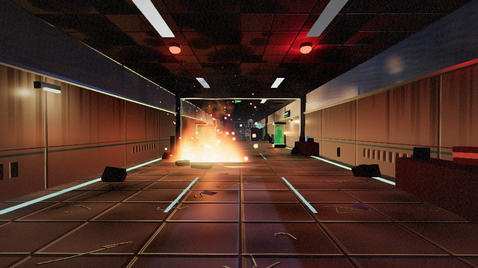
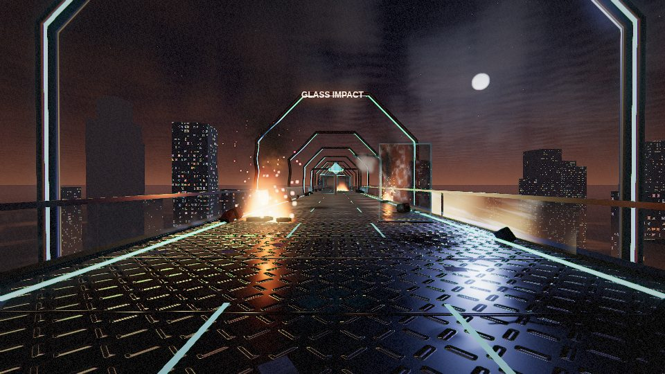
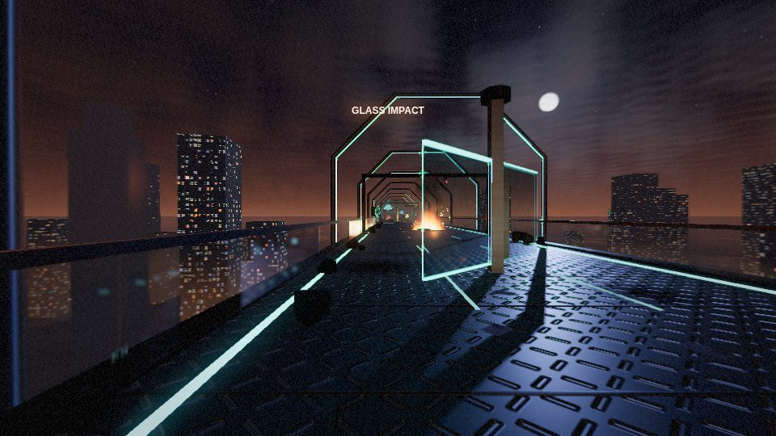
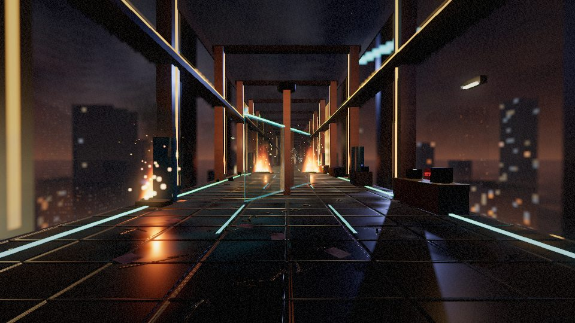
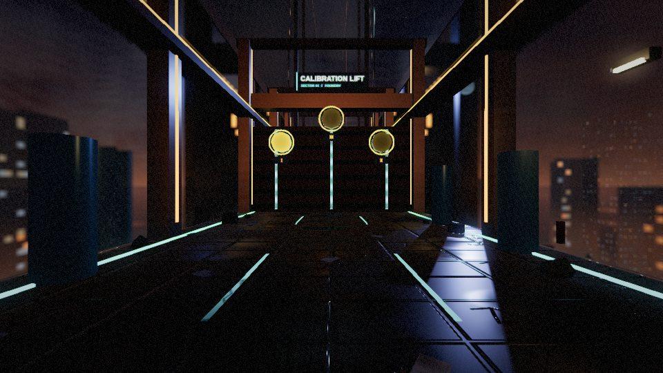

# Pull request: Level 1 - The Glass Causeway

Branch: `feature/level-1-causeway` → `main`

This file is the pull request description (paste it into GitHub) followed by the steps to push the branch.

---

## Summary

Builds Level 1 as a full level module, replacing the greybox Level 1 in `main.js`, and connects it to Level 2 through a playable Calibration Lift. Level 1 follows the same contract as the Foundry (`src/levels/causeway/` mirrors `src/levels/foundry/`), so both levels are driven the same way.

## What's new

**Level** (`src/levels/causeway/`)
- Three beats - containment ward, skybridge, resonance atrium - 784 m, plus wake-up cinematic, three-lock finale and lift ride.
- Fire, sprinklers (shoot the glass bulb), smoke and vents, ceiling collapses, skybridge collapse chase, rotating glass sculptures, security doors, specimen tanks, five case files.
- Streaming layout and an instanced corridor treadmill; endless mode from a seeded chunk generator.

**Shaders** (`src/levels/causeway/shaders/`, `src/fx/`)
- Ray-traced glass (Fresnel, dispersion, Beer-Lambert, impact cracks), ray-marched volumetric fire, ray-marched cloud sky, SDF serum capsules, crystal, hologram, shield, energy conduit.
- GPU rigid-body shards fractured around the hit point; GPU embers, water, smoke, bursts.
- Custom post pipeline: world / refraction snapshot / glass / FX passes, bloom, FXAA, heat haze, thermal vision, power-up looks, photo filters.
- Reflection probe (one face per frame), wet reflective floor, sun shadows, pooled lights.

**Systems and UI**
- Sphere types (glass, cryo, shock), serums (prism, thermal, shield, overdrive), sprint/brake, focus (bullet time).
- Missions with persistent progress; Endless lab unlocked by clearing Level 1.
- Level 1 HUD (ECG integrity, tools, missions, intercom), orthographic minimap, photo mode with 360° export, level preview flythrough, field manual, graphics quality setting with Auto dynamic resolution, performance overlay.

**Fixes that also help Levels 2 and 3**
- Projectiles and legacy shards no longer allocate a new geometry per throw/shard (memory leak).

## Changes to shared files

- `main.js` reorganised around the new level. The Foundry integration block is unchanged. See `docs/level-transition.md` §4 for everything that affects Level 2.
- `index.html`: field manual screen, preview bar, fade overlay, new start-screen buttons, graphics settings, updated controls and story text.
- `styles.css`: additions only, at the end of the file.
- `docs/project-brief.md`: a concept-update note under Level 1.

## Revision 2 - playtest feedback

- **Night, 03:47.** Moonlight, fire, emergency lamps and failing fluorescents; stars, moon and a burning city under the clouds.
- **A destroyed, burning lab.** Wall fires with soot columns; seeded set dressing in every section (benches, glitching monitors, gas cylinders, extinguishers, biohazard bins, hanging ceiling tiles and cables, papers, rubble, scorch, wall-breach glow, emergency lamps, exit signs, cryo tanks); sooted, cracked and stained textures.
- **Visible sprinklers.** Water streaks (a back-face culling bug hid them before), ten heat-burst heads that shower the route, floor mist, wet floors, water on the lens.
- **Tremors and fear.** Random rumbles with dust, sparks and blackouts; breathing sway; heartbeat vignette pulse.
- **Readable glass, no glare.** Glass grime and soot, dimmer strips, restrained bloom.
- **Customisable HUD.** VIEW menu / `V` / Settings; `H` hides everything; sparse defaults; intercom as subtitles.
- **Nothing blocks the start.** Briefing and missions on the start screen; 2.5 s skippable wake-up.
- **No sound.** Audio and voice removed from the whole game (another member's task).

## Revision 3 - pace

- The run starts sedated (6 m/s, blurred and doubled vision, heavy steps, slow heartbeat) and builds to full pace by the end of the ward as adrenaline takes over; peak on the collapsing skybridge; slight settle in the atrium. Explosions cause a short fright surge. Sprint/brake are relative to the pace. New `pace` check.

## Revision 4 - vision, aiming, vents, case files

- **Sharp vision after the wake-up.** The sedation blur and sway now fade out within ~40 m (about six seconds) on their own curve; the pace still builds through the ward. Other lingering softness removed: Auto quality cuts hidden work first and never renders below 85% (plus a sharpening pass), heat shimmer only above gameplay fires, lens water clears in about a second.
- **Aiming fixed.** The crosshair follows the mouse and shows the real aim point (it used to sit in the centre while throws went to the pointer). Aim assist for small targets near the crosshair (toggle in Settings), leading moving targets, near-miss tolerance on small targets, calmer camera. Applies to all levels.
- **Vents easy to find.** Lower, angled toward the runner, glowing cyan ring that pulses in smoke, "SMOKE VENT" sign; once broken, the ring turns green and smoke spirals in.
- **Case files easy to find.** Gold holograms in a column of light with a floor ring, at chest height; run through or shoot; "Case file N of 5" card.
- New `aim` check (eight checks in total).

## How it was tested

- `node tests/causeway/run.js` - eight checks, all passing (including `pace` and `aim`): layout rules, bot playthrough into Level 2, failure states, mechanics, no memory growth over five restarts, endless streaming.
- `node tests/foundry/run.js` - passes unchanged.
- Visual checks of every beat, the lift and the HUD; screenshots in `docs/images/causeway/`.
- Draw calls measured at 184-277 per frame and 58-87k triangles across the level (all passes included).

**Still to do on real hardware:** record frame rates with the `F` overlay on a lab machine and add them to `docs/level-1-causeway.md` §11.

## Screenshots

| | |
| --- | --- |
|  |  |
|  |  |
|  |  |

## Documentation

`docs/level-1-causeway.md`, `docs/shaders-explained.md`, `docs/level-transition.md`, `docs/test-plan-level-1.md`, `docs/credits.md`, README.

## AI assistance

Level 1's code, shaders, tests and documentation were written with the help of Claude (an AI assistant). This is recorded in `docs/credits.md`; declare it as the course requires.

---

## Pushing the branch

From the folder that contains your clone of the repository:

```text
git checkout main
git pull
git checkout -b feature/level-1-causeway
```

Copy the contents of the delivered `CGV-Shattershift-main` folder over your clone (replace existing files). Do **not** copy a `node_modules` folder if one exists. Then:

```text
git status
git add -A
git commit -m "Level 1: The Glass Causeway, lift hand-off to Level 2, docs and checks"
git push -u origin feature/level-1-causeway
```

Open GitHub, create a pull request from `feature/level-1-causeway` into `main`, paste this file's text as the description, and ask a teammate to review (per `CONTRIBUTING.md`).

Before merging, the reviewer should:

```text
python -m http.server 4173
```

open `http://localhost:4173/` in Chrome, play from the menu into Level 2, and run both harnesses.

If you prefer smaller commits for contribution evidence, commit in this order:

1. `src/levels/causeway/` - the level module
2. `src/fx/`, `src/systems/`, `src/ui/causeway-hud.*` - pipeline, systems, HUD
3. `main.js`, `index.html`, `styles.css` - integration
4. `tests/causeway/` - checks
5. `docs/`, `README.md` - documentation
